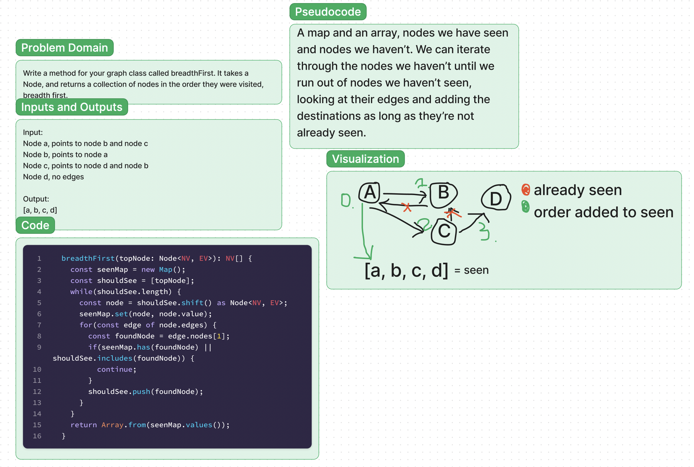

# Graphs - Breadth First
Implement the breadthFirst function.

## Whiteboard

## Challenge

Write a method for your graph class called breadthFirst. It takes a Node, and returns a collection of nodes in the order they were visited, breadth first.

## Approach & Efficiency

I chose to choose iteration as my approach, instead of recursion. I used a map and an array, nodes we have seen and nodes we haven’t. We can iterate through the nodes we haven’t until we run out of nodes we haven’t seen, looking at their edges and adding the destinations as long as they’re not already seen.
