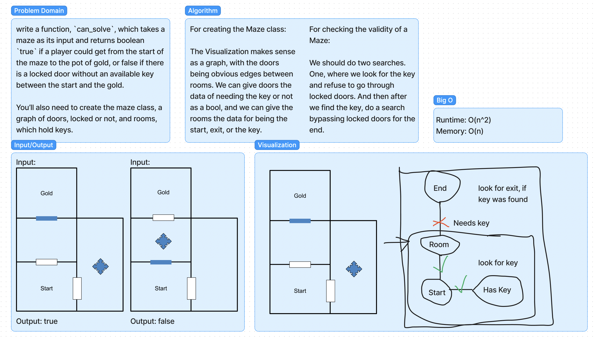

# Graphs - Breadth First
Implement the breadthFirst function.

## Whiteboard

## Challenge

write a function, `can_solve`, which takes a maze as its input and returns boolean `true` if a player could get from the start of the maze to the pot of gold, or false if there is a locked door without an available key between the start and the gold.

You’ll also need to create the maze class, a graph of doors, locked or not, and rooms, which hold keys.

## Approach & Efficiency

### Class

The Visualization makes sense
as a graph, with the doors
being obvious edges between
rooms. We can give doors the
data of needing the key or not
as a bool, and we can give the
rooms the data for being the
start, exit, or the key.

### Function

We should do two searches.
One, where we look for the key
and refuse to go through
locked doors. And then after
we find the key, do a search
bypassing locked doors for the
end.
