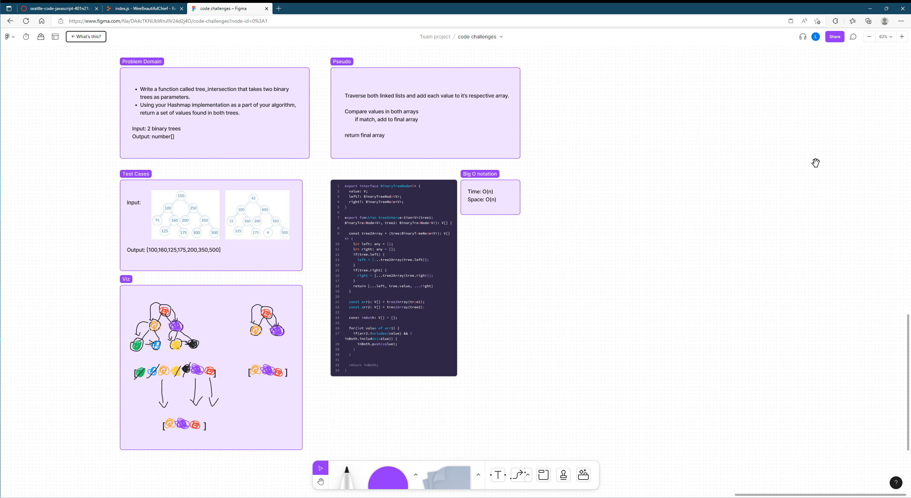

# treeIntersection

## Whiteboard

## Approach

Broke it down into two parts: 1. turn the trees into arrays and 2. compare the arrays to see which values are in both. We iterated through one array and used arr.includes() to check if the value was in the second array. In the end we learned that this makes the big O notation O(n^2) which is definitely not ideal. Ideally, we could create a map and then check if the values in the first array are included in the map to find intersections.
