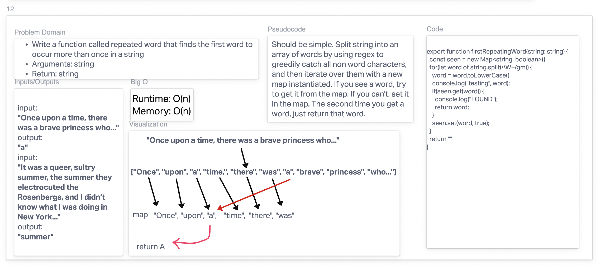

# First Repeated Word

In this challenge, I had to return the first word that repeats twice, given a string.

## Drawing

## Approach & Efficiency
<!-- What approach did you take? Why? What is the Big O space/time for this approach? -->
Should be simple. Split string into an array of words by using regex to greedily catch all non word characters, and then iterate over them with a new map instantiated. If you see a word, try to get it from the map. If you can't, set it in the map. The second time you get a word, just return that word.

## Solution
<!-- Show how to run your code, and examples of it in action -->

To run the tests, try `npm test`
