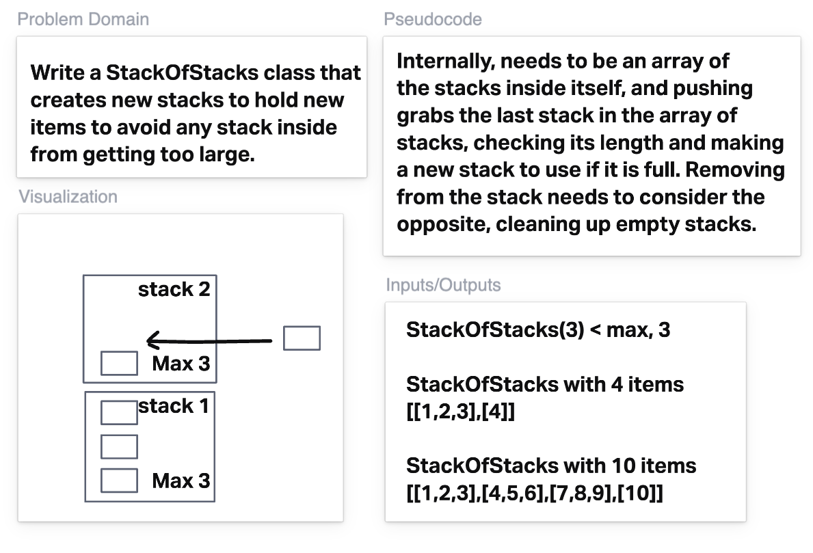

# Set of Stacks

Imagine a (literal) stack of plates.
If the stack gets too high, it might topple.
There-fore, in real life, we would likely start a new stack when the previous stack exceeds some threshold.
Implement a data structure SetOfStacks that mimics this.
SetOfStacks should be composed of several stacks, and should create a new stack once the previous one exceeds capacity.
`push()`, `pop()`, `peek()` should behave identically to a single stack (that is, pop() should return the same values as it would if there were just a single stack).

When you go to implement this class, you must correctly use the provided Stack class.
The provided Stack class handles the "toppling over" by throwing an error when the stack is "too tall".

## Design Decisions

I decided to throw errors on invalid conditions, to match the pattern of toppling throwing errors. I liked having all the stack getting logic in one helper, but for a future implementation I might want to split it into two helpers so you don't have to consider the boolean argument which isn't immediately obvious at when you're supposed to have it as `true` or `false`

## How to run

1. run `npm i` to install dependencies
2. run `npm test` to run tests

## Whiteboard

## TypeScript Instructions

- Verify your types are correct with `npm run check`
- Verify your implementation is correct with `npm run test`
  - When converting the value in a node to a string, use the `display` function in [`Collection.ts`](./src/Collection.ts).
- DO NOT edit [assignment.test.ts](./src/).
- Tests must pass the github workflow for full credit.

## TypeScript resources

- [Typescript Handbook](https://www.typescriptlang.org/docs/handbook/intro.html)

### Common Types

- `boolean` is `true` or `false`.
- `number` is any JavaScript number - `5`, `-17`, `22.356`, `3/10`, `Number.MAX_VALUE`, etc.
- `string` is any JavaScript string - `'hello'`, `'goodbye'`, `\`I am ${age}\``
- `interface Person { name: string; age: number; }` is a JavaScript object with two properties, `name` and `age`. `name` must be a string, and `age` must be a number.
- `(name: string, age: number) => Person` is a function with two parameters, `name` (a string) and `age` (a number), which will return an object of type `Person`.
- `() => void` is a function with no arguments, and returns nothing.
  <!-- - `'hello'`' is the JavaScript string `'hello'` and no other string. -->
  <!-- - `'hello'|'goodbye'` is either the JavaScript string `'hello'` or the string `'goodbye'`, and no other strings. -->
