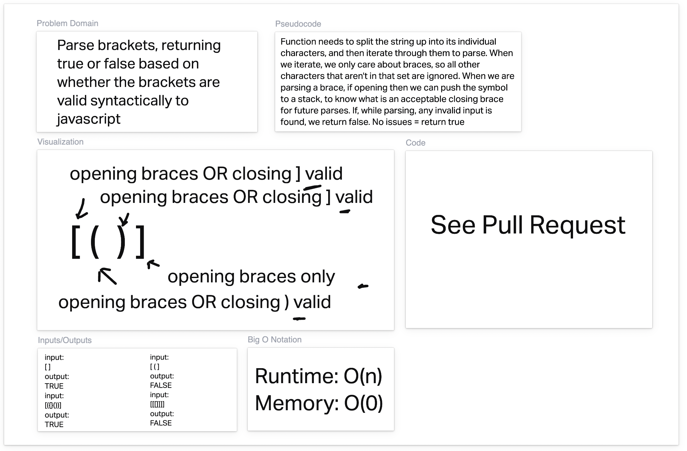

# Code Challenge 13: Stack Queue Brackets

## Description

On an interval, emits packages of data that are slowly passed down an event chain.
Demonstrates how events work!

## UML

## How to use

run `npm i` to grab dependencies

run `npm test` to run tests

## Helpful people

Derek, for his work as a driver (we co-coded the solution) and for his help whiteboarding the UML
