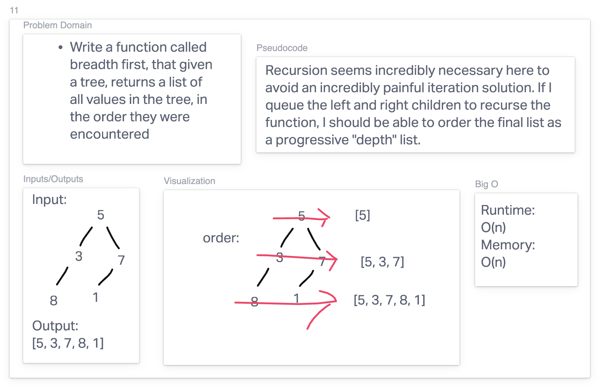

# Breadth-first

## Whiteboard

## Approach

This is still somewhat recursive? In design, but we can't just call functions and pass up return values, because we're achieving depth sorting by running a queue of which children should be added first. But again, the idea is the same. Fun challenge!
