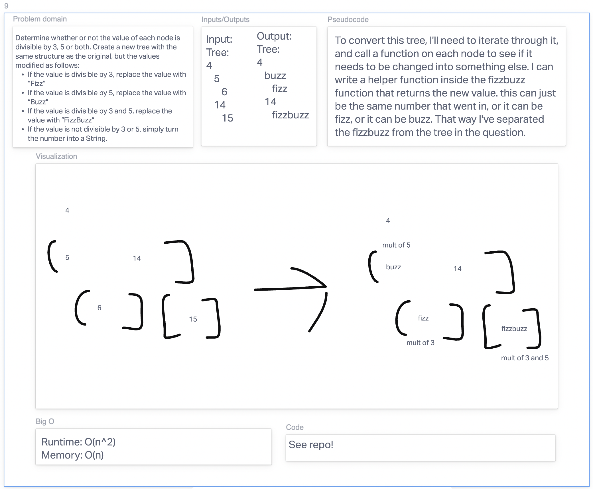

# Fizzbuzz

## Whiteboard

## Approach

I wanted to make sure my solution for this was recursive, as it has grown on me as the easiest way to handle trees. Recursion is, in a word, something that changes the scope of a tree to just handling what you do to the nodes under the node you're looking at, and what you pass to the node above the node you're looking at.
